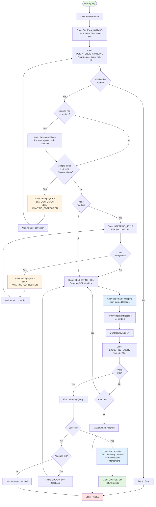

# Text-to-SQL Agent Workflow Diagrams

This document provides visual diagrams of the key workflows in the Text-to-SQL agent system.

---

## 1. Main Text-to-SQL Generation Workflow

This diagram shows the complete end-to-end workflow from user query to SQL execution.



### Key States:
- **INITIALIZING**: Agent starts up
- **SCHEMA_LOADING**: Load database schema
- **QUERY_UNDERSTANDING**: Analyze user query
- **INFERRING_JOINS**: Infer join conditions
- **GENERATING_SQL**: Generate SQL query
- **EXECUTING_QUERY**: Validate and execute
- **AWAITING_CORRECTION**: Waiting for user input
- **COMPLETED**: Success
- **FAILED**: Error state

---

## 2. Memory Management Workflow

This diagram shows how the system learns from experience and applies lessons.


### Lesson Types:

1. **Table Mapping Lessons**
   - Maps schema names to actual database names
   - Example: `Customers` → `PROD_Customers`
   - Applied automatically during SQL generation

2. **Column Mapping Lessons**
   - Maps user terms to actual columns
   - Example: "region" → `Customers.geographic_area`

3. **Error Pattern Lessons**
   - Common error patterns and fixes
   - Example: Missing PROD_ prefix

4. **Query Pattern Lessons**
   - Successful query templates
   - Example: Date filtering patterns

### Learning Triggers:

1. **Error Recovery**: SQL failed then succeeded (confidence: 0.8-0.9)
2. **User Corrections**: User provides explicit corrections (confidence: 0.95)
3. **Reinforcement**: Successful SQL using lessons (update success_rate)

---

## 3. Ambiguity Detection & Correction Workflow

This diagram shows how the system detects and resolves ambiguities through user interaction.

```mermaid
flowchart TD
    subgraph TableSelection["Table Selection Ambiguity (NEW)"]
        QU1[Query Understanding] --> CheckJoins1{Joins<br/>needed?}
        CheckJoins1 -->|Yes| ContinueTable[Continue to SQL generation<br/>Trust LLM decision]
        CheckJoins1 -->|No| CheckTableCorrections{Table corrections<br/>applied?}
        CheckTableCorrections -->|Yes| SkipTableCheck1[Skip ambiguity check<br/>User already resolved]
        SkipTableCheck1 --> ContinueTable

        CheckTableCorrections -->|No| CheckTableCount{Multiple<br/>tables identified?}

        CheckTableCount -->|Yes| RaiseAmbiguity[Raise AmbiguityError<br/>LLM CONFUSION:<br/>Multiple tables but no joins<br/>Query should use ONE table]

        CheckTableCount -->|No| TrustLLM[Trust LLM decision<br/>Single table selected]
        TrustLLM --> ContinueTable

        RaiseAmbiguity --> ErrorDetails[type: table_selection<br/>options: identified tables<br/>context: selected_table]
    end

    subgraph JoinInference["Join Inference Ambiguity (EXISTING)"]
        JI1[Join Inference] --> InferJoins[Infer join conditions<br/>using LLM]
        InferJoins --> CheckJoinConf{Confidence >=<br/>threshold 0.75?}
        CheckJoinConf -->|No| MultiJoins{Multiple<br/>candidates?}
        CheckJoinConf -->|Yes| ContinueJoin[Continue to SQL generation]

        MultiJoins -->|Yes| RaiseJoin[Raise AmbiguityError<br/>type: join_inference<br/>options: join candidates<br/>context: tables, conditions]
        MultiJoins -->|No| ContinueJoin
    end

    subgraph ErrorHandling["Ambiguity Error Handling"]
        RaiseTable --> Caught[Orchestrator catches<br/>AmbiguityError]
        RaiseJoin --> Caught

        Caught --> Transition[State transition to<br/>AWAITING_CORRECTION]
        Transition --> ReturnError[Return to user:<br/>- error: 'ambiguity'<br/>- message: description<br/>- options: list of choices<br/>- session_id]
    end

    subgraph UserCorrection["User Provides Correction"]
        UserInput[User calls:<br/>continue_with_correction] --> Parse{Parse correction<br/>format}

        Parse -->|Natural| ParseTable["use table X"<br/>"select X not Y"<br/>"table X"]
        Parse -->|Structured| ParseDict["type: table_selection<br/>selected_table: X<br/>rejected_tables: [Y,Z]"]
        Parse -->|Natural| ParseJoin["join A.id with B.a_id"<br/>"A.id = B.a_id"]

        ParseTable --> CreateTableCorrection[Create TableSelectionCorrection]
        ParseDict --> CreateTableCorrection
        ParseJoin --> CreateJoinCorrection[Create JoinClarification]

        CreateTableCorrection --> AddToSession[Add correction to session:<br/>- session.corrections.append<br/>- session.hard_constraints.append<br/>- increment correction_attempt]
        CreateJoinCorrection --> AddToSession
    end

    subgraph Retry["Retry with Correction"]
        AddToSession --> RetryQU[Retry Query Understanding]
        RetryQU --> ApplyTableCorrections{Table correction<br/>exists?}
        ApplyTableCorrections -->|Yes| ModifyTables[Modify table list:<br/>- Remove rejected tables<br/>- Add selected table<br/>- Skip ambiguity check]
        ApplyTableCorrections -->|No| NoModify[Use LLM tables]

        ModifyTables --> RetrySQL[Retry SQL Generation<br/>with correction constraints]
        NoModify --> RetrySQL

        RetrySQL --> ConstraintsAdded[Constraints in prompt:<br/>"MANDATORY TABLE: Use X"<br/>"DO NOT use: Y, Z"]
        ConstraintsAdded --> Success{SQL<br/>successful?}
        Success -->|Yes| LearnCorrection[Learn from correction:<br/>Create TableMappingLesson]
        Success -->|No| CheckRetries{Max corrections<br/>reached?}
        CheckRetries -->|No| UserInput
        CheckRetries -->|Yes| GiveUp[Max corrections exceeded]
    end

    style RaiseTable fill:#ffe1e1
    style RaiseJoin fill:#ffe1e1
    style CreateTableCorrection fill:#e1f5e1
    style CreateJoinCorrection fill:#e1f5e1
    style LearnCorrection fill:#e1f0ff
    style SkipTableCheck1 fill:#fff4e1
```

### Ambiguity Types:

#### 1. Table Selection Ambiguity (NEW)

**LLM Confusion Detection**
- **Trigger**: LLM identified multiple tables + No joins needed
- **Detection**: Simple count check (no fuzzy matching needed)
- **Logic**: If query doesn't need joins, it should use ONE table. Multiple tables = confused LLM
- **Philosophy**: Trust LLM when it picks a single table. Only intervene when LLM is obviously confused.
- **Example**:
  ```
  User: "Show customer data"
  LLM returns: ["Customers", "PROD_Customers"]
  Joins needed: No
  → AMBIGUOUS! Raise error with both tables as options
  ```
- **Action**: Raise `AmbiguityError` with identified tables as options

#### 2. Join Inference Ambiguity (EXISTING)
- **Trigger**: Multiple join candidates + Low confidence (<0.75)
- **Detection**: LLM inference with confidence scoring
- **Example**: Joining `Orders` and `Customers` → multiple possible join keys

### Correction Formats:

#### Natural Language:
```
"use table CustomersPROD"
"select CustomersPROD not Customers"
"join Orders.customer_id with Customers.id"
```

#### Structured:
```python
{
    "type": "table_selection",
    "selected_table": "CustomersPROD",
    "rejected_tables": ["Customers", "Customers_Archive"]
}
```

### Key Features:

1. **Simple Detection Strategy**:
   - **Philosophy**: Trust LLM decisions when it picks a single table
   - **Detection**: Only intervene when LLM returns multiple tables for non-join query
   - **No Proactive Checking**: We don't second-guess LLM's single-table choices by searching schema for alternatives
2. **Skip Check After Correction**: Once user provides correction, ambiguity check is skipped on retry
3. **Constraint Propagation**: Corrections converted to hard constraints in LLM prompts
4. **Learning Integration**: Successful corrections become lessons for future queries
5. **Max Attempts**: Default 3 correction attempts before giving up (`max_correction_attempts`)

### Detection Strategy:

| Scenario | LLM Result | Ambiguity? | Reason |
|----------|------------|-----------|--------|
| User: "customer data" | `["Customers", "PROD_Customers"]` | ✅ **YES** | LLM confused - returned multiple tables for non-join query |
| User: "customer data" | `["Customers"]` | ❌ **NO** | Trust LLM - single table selected |
| User: "customers and orders" | `["Customers", "Orders"]` | ❌ **NO** | Multiple tables expected - joins needed |

### Design Rationale:

**Why trust LLM for single-table selection?**
1. LLM has full context of the user query and schema
2. Reduces false positives from overly aggressive similarity matching
3. Simpler, more predictable behavior for users
4. Learning system will improve LLM choices over time
5. Users can always provide corrections if LLM picks wrong table

---

## Summary

### Main Workflow
- **Purpose**: End-to-end SQL generation from user query
- **Key Components**: State machine, LLM interactions, validation, execution
- **Error Handling**: Automatic retries (3 attempts), graceful failure

### Memory Management
- **Purpose**: Learn from experience to improve over time
- **Key Components**: Lesson repository, table mapper, learning triggers
- **Benefits**: Reduces errors, faster convergence, handles naming variations

### Ambiguity Detection
- **Purpose**: Detect unclear situations and ask user for clarification
- **Key Components**: LLM confusion detection, correction parsing, constraint application
- **Benefits**: Prevents incorrect queries, explicit user control, transparent decision-making

---

## Configuration

Key settings in `config/config.yaml`:

```yaml
agent:
  max_sql_attempts: 3                    # SQL generation retry limit
  max_correction_attempts: 3             # User correction retry limit
  confidence_threshold: 0.75             # Join inference confidence threshold
  table_ambiguity_threshold: 0.7         # [NOT USED] Reserved for future use
```

**Note**: `table_ambiguity_threshold` is currently not used because we trust LLM's single-table selections without proactive similarity checking. The parameter is reserved for future enhancements if needed.

## Related Files

- Main workflow: [`src/agent/orchestrator.py`](src/agent/orchestrator.py)
- Memory system: [`src/memory/`](src/memory/)
- Ambiguity detection: [`src/reasoning/query_understanding.py`](src/reasoning/query_understanding.py), [`src/reasoning/join_inference.py`](src/reasoning/join_inference.py)
- Corrections: [`src/correction/`](src/correction/)
